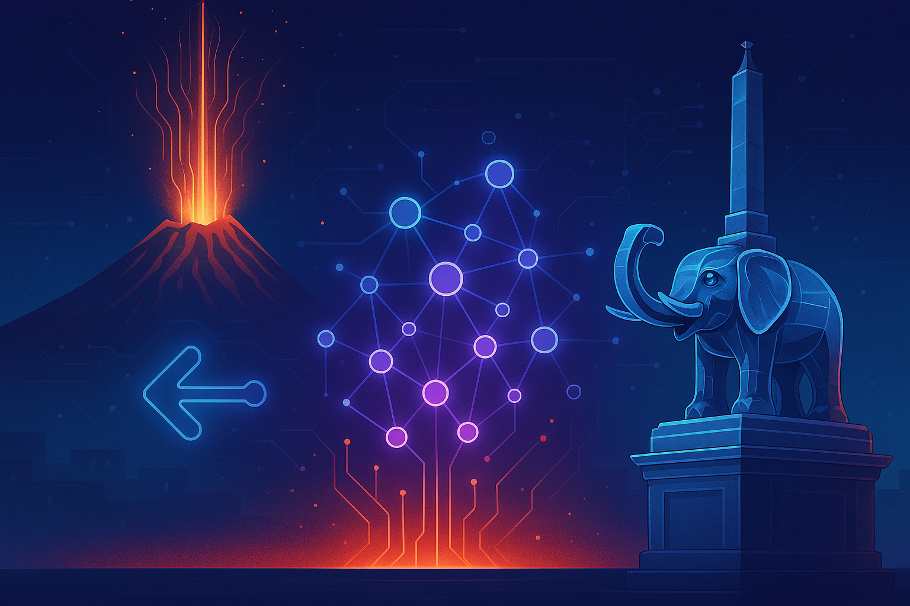
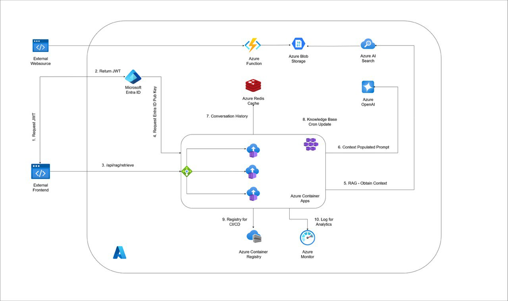

# LiotRAG: Cloud-Native RAG System for Knowledge Access  

 
 
 
 
 
  

  

---

## 📖 Project Description  

**LiotRAG** (from *Liotru*, the symbol of Catania, and *RAG*, Retrieval-Augmented Generation) is a **cloud-native knowledge assistant** built on [Microsoft Azure](https://azure.microsoft.com/) and powered by [OpenAI](https://openai.com/).  

The system scrapes and indexes resources from the **Department of Computer Science and Mathematics, University of Catania**, creating a **chatbot interface** that enables:  
- ⚡ **Fast access** to distributed information across departmental pages  
- 🔍 **RAG-based retrieval** for context-aware question answering  
- ☁️ **Scalable deployment** through Azure-native services  

By combining local cultural identity with cutting-edge AI, LiotRAG bridges **academic knowledge** with **next-generation user experiences**.  

---

## 🏛 Architecture  

  

**Key components**:  
- 🔹 Web Scraper → Extracts content from departmental websites  
- 🔹 Azure Storage & Azure Cognitive Search → Centralized indexing of assets  
- 🔹 RAG Pipeline with OpenAI API → Context-aware retrieval and LLM integration  
- 🔹 Chatbot Interface → User-friendly Q&A with natural language  

---

## 🌋 Vision  

- Enhance **student and faculty productivity** by reducing search times  
- Showcase how **RAG and cloud-native AI** can serve **local academic communities**  
- Embed **Catania’s identity** (Etna, Liotru) into a **modern AI research initiative**  

---

## 📜 License  

[GPL-3.0](LICENSE) — Free to use, modify, and redistribute under the same terms.  

---
