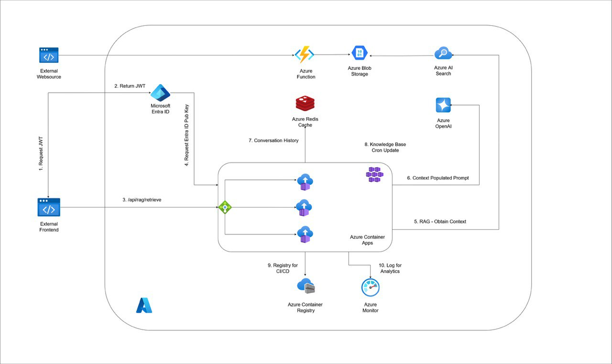

# LiotRAG: un assistente virtuale in Cloud per Il DMI

**Studenti**: Luca Strano & Andrew Darnall

**Professore**: Giuseppe Pappalardo

## Introduzione

Il progetto rappresenta la realizzazione di un assistente virtuale per il Dipartimento di Matematica ed Informatica (DMI) in grado di rispondere alle domande degli utenti tramite l'utilizzo delle Informazioni Certificate contenute alll'interno del [sito del DMI](https://web.dmi.unict.it). L'assistente virtuale è stato implementato utilizzando tecnologie di intelligenza artificiale, in particolare _modelli di linguaggio di grandi dimensioni_ (LLM) e tecniche di _retrieval-augmented generation_ (RAG).
Per la realizzazione del progetto sono stati utilizzati i servizi cloud di [Azure](https://azure.microsoft.com/it-it) insieme ad i servizi AI di [Azure AI Foundry](https://azure.microsoft.com/it-it/products/ai-foundry).

## Disegno Architetturale

L'architettura del sistema è composta da diversi componenti che lavorano insieme per fornire risposte accurate e pertinenti alle domande degli utenti. Di seguito è riportato un diagramma che illustra l'architettura del sistema.

## Feature Principali

L'assistente virtuale LiotRAG offre diverse funzionalità principali:

- **Estrazione delle Informazioni Certificate**: Utilizza tecniche di web scraping per estrarre informazioni dal sito del DMI, garantendo che le risposte siano basate su dati ufficiali e aggiornati.

- **Indicizzazione Dinamica**: Le informazioni vengono periodicamente estratte dalla fonte dati e confrontate con quelle già presenti nell'indice per aggiornare solo le nuove informazioni, riflettendo così le modifiche apportate al sito del DMI.

- **Risposte Contestuali**: Grazie all'uso di LLM e tecniche di RAG, l'assistente è in grado di fornire risposte contestuali e pertinenti alle domande degli utenti.

-  **Conversazioni Multiturno**: Il sistema tiene traccia del contesto delle conversazioni, permettendo agli utenti di porre domande di follow-up senza dover ripetere informazioni precedenti.

- **Autenticazione**: L'accesso all'assistente è protetto da un sistema di autenticazione con Json Web Token (JWT) basato su Azure EntraID, garantendo che solo gli utenti autorizzati possano interagire con il sistema.

- **Interfaccia Utente**: L'assistente virtuale è accessibile tramite un'interfaccia web customizzata, che consente agli utenti di porre domande e ricevere risposte in modo semplice e veloce.

## Esempio di Utilizzo

Di seguito è riportato un esempio di utilizzo dell'assistente virtuale LiotRAG tramite l'interfaccia web:

## Tecnologie Utilizzate

Di seguito sono elencate le tecnologie utilizzate per la realizzazione del progetto.

### Azure AI Foundry

Azure AI Foundry è una piattaforma di servizi AI che offre una serie di strumenti e servizi per la creazione, il training e il deployment di modelli di intelligenza artificiale. LiotRAG effettua il deploy dei seguenti modelli OpenAI:

- **gpt-4.1-mini**: LLM Principale utilizzato per la generazione delle risposte e del rewrite delle domande degli utenti.

- **embedding-3-small**: Modello di embedding utilizzato per la creazione degli embedding delle informazioni contenute nella Knowledge Base.

### Azure Key Vault

Azure Key Vault è un servizio di gestione dei segreti che consente di proteggere e gestire in modo sicuro le chiavi crittografiche, i certificati e altri segreti utilizzati dalle applicazioni. LiotRAG utilizza Azure Key Vault per archiviare in modo sicuro le chiavi API necessarie per interagire con i servizi di Azure AI Foundry.

### Azure Functions

Azure Functions è un servizio di calcolo serverless che consente di eseguire codice in risposta a determinati eventi customizzabili. LiotRAG utilizza Azure Functions per implementare la logica di Scraping per l'estrazione delle informazioni dal sito del DMI. L'azure function viene eseguita attraverso un _Time Trigger_ che scatta ogni giorno all'una di notte. La logica di scraping è stata implementata tramite il framework [Scrapy](https://www.scrapy.org/), un framework open-source per il web scraping in Python. Le pagine del DMI vengono selezionate attraverso diverse whitelist e blacklist di URL. Ogni pagina selezionata viene poi inserita all'interno di una pipeline asincrona che processa, converte in markdown e salva all'interno di un Azure Blob Storage le pagine in input. Il salvataggio delle pagine nel Blob Storage avviene solamente se la pagina è stata modificata rispetto alla versione precedentemente salvata, in modo da evitare ridondanze e re-indexing non necessari. Il confronto tra le versioni delle pagine viene effettuato tramite l'uso di hash crittografici sul contenuto di queste.

### Azure Blob Storage

Azure Blob Storage è un servizio di archiviazione di oggetti scalabile e sicuro che consente di archiviare grandi quantità di dati non strutturati. LiotRAG utilizza Azure Blob Storage per archiviare i file markdown estratti dal sito del DMI, che vengono poi processati e indicizzati da Azure AI Search per la creazione della Knowledge Base. I file vengono inseriti ed aggiornati attraverso l'uso della Azure Function precedentemente descritta.

### Azure AI Search

Azure AI Search è un servizio di ricerca basato su cloud che consente di creare esperienze di ricerca avanzate per le applicazioni. LiotRAG utilizza Azure AI Search come infrastruttura per la Knowledge Base dell'applicazione, sfruttando il modello di embedding deployato in Azure AI Foundry per indicizzare, vettorizzare e ricercare le informazioni estratte dal sito del DMI. L'indicizzazione delle informazioni avviene tramite l'uso di una _skill_ che processa i file markdown estratti dal sito web e contenuti all'interno di un Blob Storage.

### Azure Cache for Redis

Azure Cache for Redis è un servizio di caching in-memory basato su Redis che consente di migliorare le prestazioni delle applicazioni riducendo la latenza e il carico sui database. LiotRAG utilizza Azure Cache for Redis per memorizzare temporaneamente le conversazioni degli utenti, permettendo così di mantenere il contesto delle conversazioni multiturno. Le conversazioni vengono salvate con una TTL di un'ora, dopo la quale vengono automaticamente rimosse dalla cache.

### Azure EntraID

Azure EntraID è un servizio di gestione delle identità e degli accessi basato su cloud che consente di proteggere l'accesso alle applicazioni e ai dati. LiotRAG utilizza Azure EntraID per implementare un sistema di autenticazione basato su Json Web Token (JWT), garantendo che solo gli utenti autorizzati possano accedere all'assistente virtuale.

### Azure Container Apps

Azure Container Apps è un servizio di orchestrazione di container serverless che consente di eseguire applicazioni containerizzate in modo scalabile e gestito. La scalabilità avviene tramite l'utilizzo di [KEDA](https://keda.sh), che permette di scalare le applicazioni in base a metriche personalizzate come il numero di richieste o risorse di sistema. Lo scaling è impostato a partire da un minimo di 0 istanze (scale-to-zero durante inoperabilità) fino ad un massimo di 3 istanze.

LiotRAG utilizza Azure Container Apps per il deployment del frontend customizzato realizzato tramite (Chainlit)[https://docs.chainlit.io/get-started/overview] e dell'API RESTful di orchestrazione che gestisce le richieste degli utenti e interagisce con i vari componenti del sistema. L'API è stata sviluppata utilizzando il framework [FastAPI](https://fastapi.tiangolo.com/), un framework web moderno e ad alte prestazioni per la creazione di API in Python. L'API di backend espone i seguenti endpoint principali:

- `GET /health`: Endpoint di health check per verificare lo stato di funzionamento dell'API.
- `GET /auth_test`: Endpoint di test per verificare il corretto funzionamento del sistema di autenticazione.
- `GET /get_auth`: Endpoint per ottenere un token di autenticazione JWT basato su Azure EntraID.
- `POST /chat`: Endpoint principale per porre domande all'assistente virtuale e ricevere risposte.

Il flow di una richiesta di chat è il seguente:

1. L'utente invia una richiesta `POST /chat` con la domanda e il token di autenticazione JWT.
2. L'API verifica il token di autenticazione e, se valido, procede con la gestione della richiesta.
3. Viene effettuato il fetch delle ultime `n` interazioni con l'utente dalla cache Redis per mantenere il contesto della conversazione. Se è presente uno storico, viene effettuato il rewrite della domanda dell'utente attraverso `gpt-4.1-mini`.
4. Viene effettuata una ricerca nella Knowledge Base tramite Azure AI Search per recuperare i documenti più pertinenti alla domanda.
5. Viene costruito il prompt per il modello LLM `gpt-4.1-mini`, includendo la domanda, il contesto della conversazione e i documenti recuperati
6. Viene invocato il modello LLM per generare la risposta alla domanda.
7. Il turno conversazionale viene salvato nella cache Redis.
8. La risposta viene inviata all'utente.

## Pipeline di Deployment (Workflow `azure-deploy.yml`)

Il progetto LiotRAG implementa una pipeline di CI/CD completamente automatizzata tramite GitHub Actions per gestire il deployment su Azure. La pipeline è configurata nel file `.github/workflows/azure-deploy.yml` e si attiva automaticamente quando vengono pushati cambiamenti sul branch `main` che interessano le cartelle `src/container-app/`, `src/function-app/` o `src/frontend/`.

### Struttura della Pipeline

La pipeline è composta da 5 job principali che vengono eseguiti in parallelo o sequenzialmente secondo le dipendenze. Di seguito è riportata una descrizione dettagliata di ciascun job.

### 1. **build-and-push**
- Costruisce l'immagine Docker dell'API backend utilizzando il `Dockerfile.aca`
- Effettua il push dell'immagine su Azure Container Registry (ACR)
- Tagga l'immagine con il nome del branch e l'hash del commit per il versioning
- Salva il tag dell'immagine come artifact per i job successivi

### 2. **deploy-container-app**
- Dipende dal completamento di `build-and-push`
- Deploya l'API backend come Azure Container App
- Configura automaticamente tutte le variabili d'ambiente necessarie
- Gestisce sia l'aggiornamento di Container App esistenti che la creazione ex-novo

### 3. **deploy-function-app**
- Eseguito in parallelo ai job di deployment delle Container App
- Crea un pacchetto ZIP della Function App dal codice in `src/function-app/`
- Carica il pacchetto su Azure Blob Storage
- Configura Azure Functions per eseguire il codice dal pacchetto remoto utilizzando `WEBSITE_RUN_FROM_PACKAGE`

### 4. **frontend-build-and-push**
- Eseguito in parallelo al build del backend
- Costruisce l'immagine Docker del frontend utilizzando il `Dockerfile.frontend`
- Effettua il push su ACR con versioning appropriato

### 5. **deploy-frontend-container-app**
- Dipende dal completamento di `frontend-build-and-push`
- Deploya il frontend come Azure Container App separata
- Configura le stesse variabili d'ambiente dell'API backend per garantire coerenza

## Conclusione

Attraverso l'utilizzo di servizi cloud scalabili e gestiti come Azure Container Apps, Azure AI Foundry, Azure Functions e Azure AI Search, LiotRAG è in grado di offrire un assistente virtuale efficiente, sicuro e facilmente manutenibile. L'architettura modulare e l'adozione di best practice nello sviluppo e nel deployment garantiscono che il sistema possa evolvere nel tempo per soddisfare le esigenze degli utenti e del Dipartimento di Matematica ed Informatica.